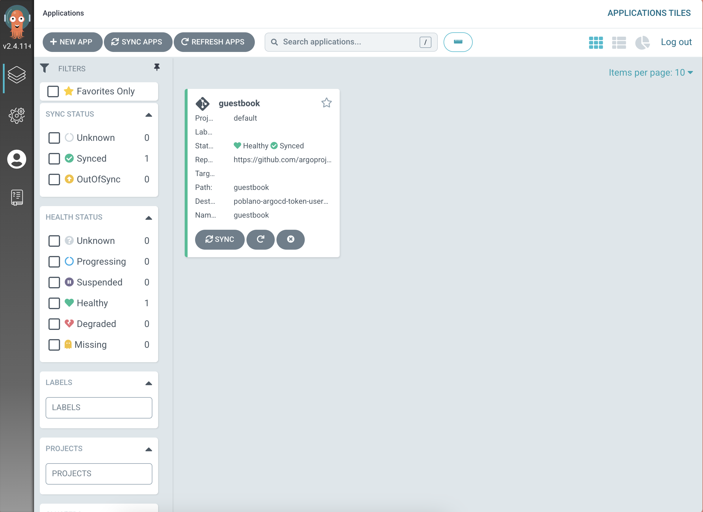
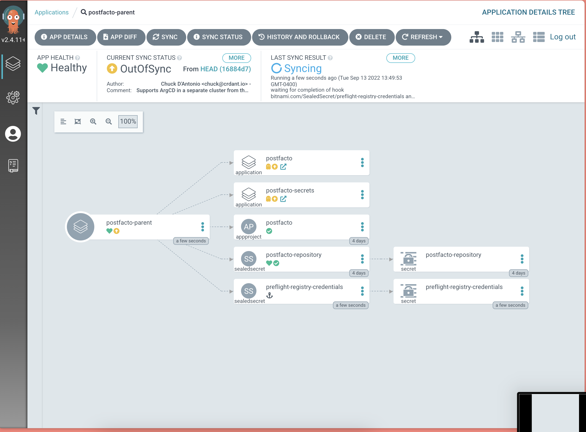
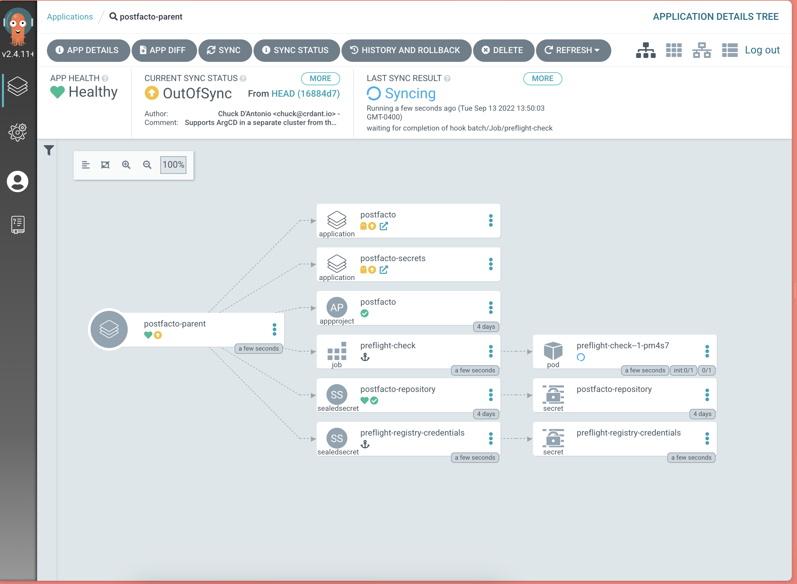
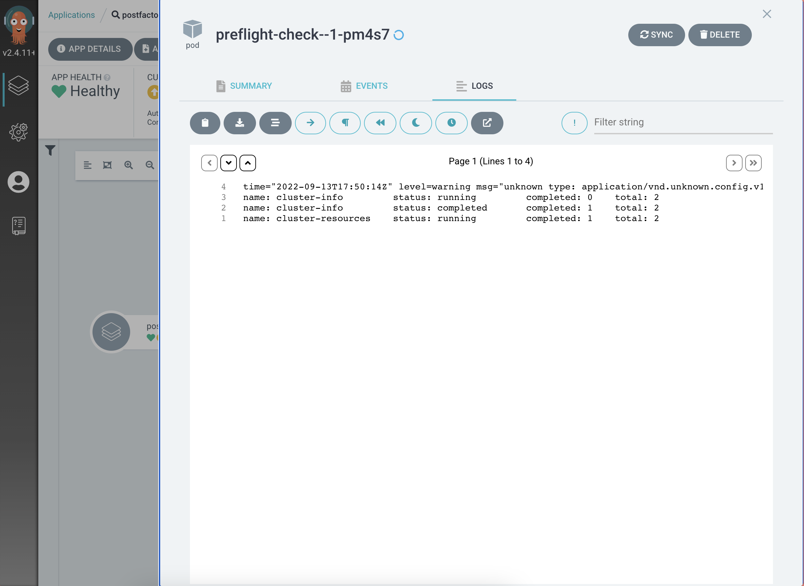
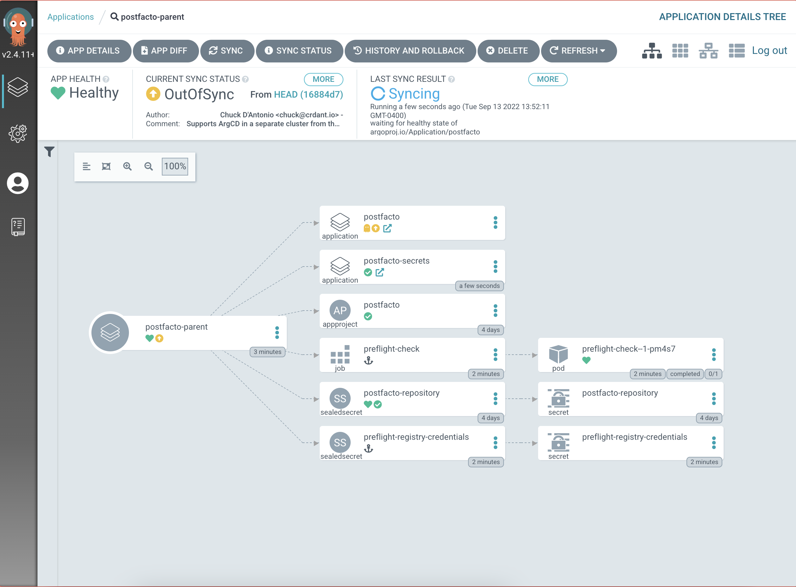
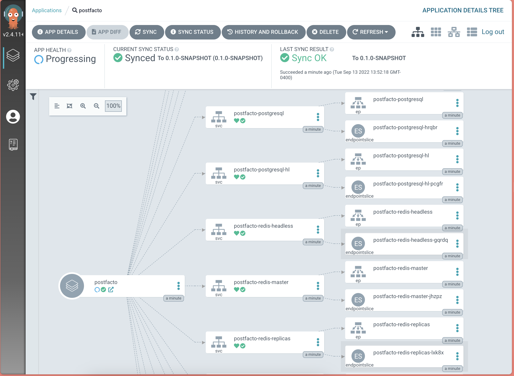
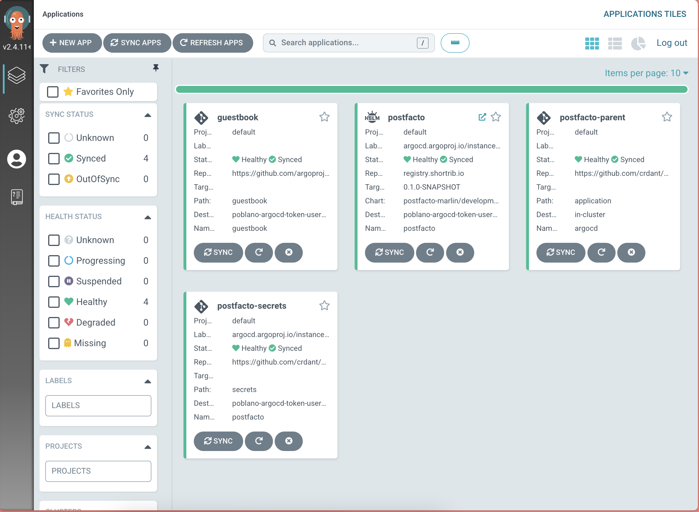

# GitOps with Argo CD, Helm, and Replicated KOTS

This repository contains the code and configuration needed to 
demonstrate GitOps deployment of a [KOTS](https://kots.io) 
app with [Argo CD](https://argo-cd.readthedocs.io/en/stable/).

[](https://www.loom.com/share/ac49e6b90b3c4e61b8e910afd12d4b66 "GitOps with ArgoCD, Helm, and Replicated KOTS")

## Scenario

The demonstration considers a context in which a team is using
Replicated KOTS to distribute their application and a customer
requires a GitOps deployment using Argo CD. The current 
iteration assumes that Argo CD is running in a different cluster
from the workload, but works with a single cluster as well. A
simpler single cluster version is at the tag 
[`single-cluster-demo`](https://github.com/crdant/postfacto-argo-application/releases/tag/single-cluster-demo).

The demo application I've used is 
[Postfacto](https://pivotal.github.io/postfacto/), a tool for 
team retrospectives developed by 
[Pivotal Labs](https://en.wikipedia.org/wiki/Pivotal_Labs). I
built [a new helm chart](https://github.com/crdant/postfacto-chart)
for Postfacto, [original](https://github.com/pivotal/postfacto/tree/master/deployment/helm)
didn't have everything I needed for my own install of Postfacto.
The new chart also helped me externalize some secrets so I
could use [sealed secrets](https://github.com/bitnami-labs/sealed-secrets)
in this repo. 

I've combined a few different features of Replicated and Argo CD to 
deliver this demo.

* Preflight checks built with [Troubleshoot](https://troubleshoot.sh) 
  to assure my workload cluster is ready to run the application
* A [KOTS application](https://github.com/crdant/postfacto-replicated) 
  that packages the Postfacto Helm chart for distribution with
  Replicated.
* The Replicated private registry with a 
  [custom hostname](https://docs.replicated.com/vendor/packaging-private-registry-cname)
  _(alpha feature)_.
* Replicated support for [installing with Native Helm](https://docs.replicated.com/vendor/helm-installing-native-helm)
  _(alpha feature)_.
* Argo CD [resource hooks](https://argo-cd.readthedocs.io/en/stable/user-guide/resource_hooks/)
  to assure that my preflight checks run before the application installs.

## Running the demonstration

To run the demonstration, you will need to fork this repository.
I hate having to ask you that, but it's required since my cluster
address and sealed secrets woon't work with your repository. You'll
customize these and commit them to your fork.

Once you've forked the repo, you can use the provided `Brewfile` to
install some helpful CLIs (assuming you have Homebrew). If you don't
have Homebrew you should install [`kubeseal`](https://github.com/bitnami-labs/sealed-secrets#installation) 
and [`yq`](https://github.com/mikefarah/yq#install), and might also 
want the [`argocd`](https://argo-cd.readthedocs.io/en/stable/getting_started/#2-download-argo-cd-cli)
CLI though I'm not using it explicitly in the demonstration.

You'll also need two Kubernetes clusters, one with Argo CD installed
and another to deploy the application. I had the clusters already 
configured using [TKG Lab](https://github.com/Tanzu-Solutions-Engineering/tkg-lab) 
and it's [optional Argo CD lab](https://github.com/Tanzu-Solutions-Engineering/tkg-lab/blob/main/docs/bonus-labs/argocd-kustomize.md).
A later revision will enable setting those clusters up with 
[kurl](https://kurl.sh). If it's not already there, add 
[sealed secrets](https://github.com/bitnami-labs/sealed-secrets) to
both of your clusters.

The last thing you'll need is access to the Postfacto application as
a Replicated KOTS application. Contact me for a license to use
my release, or you can use my [chart](https://github.com/crdant/postfacto-chart)
and [application](https://github.com/crdant/postfacto-replicated) to roll with 
your own with a [vendor account](https://vendor.replicated.com) from 
Replicated.

### Setup Steps

The setup is a bit tedious, but not particularly complex. At a high-level, 
you're going to fork this repo, make sure the manifests refer to your fork
and reseal your secrets.

1. Fork this repo. Come back to this point in the README of your fork.

2. Make sure you have all the provided CLIs installed, if you're using Homebrew:

```
brew bundle install
```

otherwise follow the instructions for each CLI:

* [`kubeseal`](https://github.com/bitnami-labs/sealed-secrets#installation) 
* [`yq`](https://github.com/mikefarah/yq#install)

3. Update the manifest for the secrets application so that it references
   your repo fork and your workload cluster:

   ```
   yq -i '.spec.source.repoURL = "$FORKED_REPO_URL" application/secrets.yaml
   yq -i '.spec.destination.server = "$WORKLOAD_ENDPOINT"' application/secrets.yaml 
   ```

4. Update the manifest for the Postfacto application so that it references
   your destination cluster:

   ```
   yq -i '.spec.destination.server = "$WORKLOAD_ENDPOINT"' application/application.yaml 
   ```

5. Recreate the secrets used to access the Replicated registry. These secrets should be 
   sealed for the cluster running Argo CD.
   
   You'll need the username, password, and server address for the registry. If you're 
   using your own vendor account, create a customer license and get the username, password, 
   and registry server from the Helm install steps. If I provided you with a license, I'll 
   send you the credentials. 

   ```
   # to enable accesss to the preflight checks
   kubectl create secret docker-registry preflight-registry-credentials \
       --dry-run=client -o yaml -n argocd --docker-username $REGISTRY_USERNAME 
       --docker-password $REGISTRY_PASSWORD --docker-server $REGISTRY_SERVER \
     | kubeseal -n argocd > application/preflight-registry-credentials.yaml

   # to enable access to the HElm chart
   kubectl create secret generic postfacto-repository --dry-run=client -o yaml \
       -n argocd --from-literal=enableOCI=true --from-literal=username=$REGISTRY_USERNAME \
       --from-literal=password=$REGISTRY_PASSWORD --from-literal=url=$REGISTRY_SERVER \
       --from-literal=type=helm --from-literal=name=postfacto \
     | kubeseal -n argocd -o yaml > application/postfacto-repository.yaml
   ```

6. Recreate the secrets used by the Postfacto application. These secrets should be sealed
   against the workload cluster. You'll need to create a namespace named `postfacto` in 
   order to properly seal the secrets.

   ```
   # create namespace
   kubectl create ns postfacto

   # create secret for the postgres database
   kubectl create secret generic postfacto-postgresql -n postfacto \
       --dry-run=client -o yaml --from-literal=postgres-password=$ADMIN_PASSWORD \
       --from-literal=password=$USER_PASSWORD \
     | kubeseal -n postfacto -o yaml  > secrets/postfacto-postgresql.yaml   
   # create secret for the redis cluster
   kubectl create secret generic postfacto-redis -n postfacto \
       --dry-run=client -o yaml --from-literal=redis-password=$PASSWORD_FOR_REDIS \
     | kubeseal -n postfacto -o yaml > secrets/postfacto-redis.yaml

   # delete the postfacto namespace so we can show Argo creating it
   kubectl delete ns postfacto
   ```

7. Commit all your changes and push them to GitHub.

### Demonstration Steps

After all that setup, the demonstration is fairly straightforward. You're going to
tell Argo to do it's thing, showing the progress as it goes.

1. Open a terminal and show the namespaces on your workload cluster along with the 
   (non-existant) workloads in the `postfacto` namespace. I like to keep this running
   the whole time. I also make the context explicit because I'll be running other
   commands against the Argo CD cluster.

   ```
   watch kubectl get --context $WORKLOAD_CLUSTER_CONTEXT --namespace postfacto all,ns
   ```

2. Open a browser window to the application tiles on your Argo CD installation.

   

3. Start the installation.

   ```
   kubectl apply -f postfacto-parent.yaml
   ```

4. Switch back to the browser window and click into the application `postfacto-parent`

   

5. Wait for the preflight checks to start running

   

6. Show the logs to see that the preflights have started

   

7. Close out the logs and wait to see that the preflights have completed

   

8. Point out that the preflights are complete and that he secrets and application
    have synced and started progressing. Click through to the postfacto application
    and show it progressing.

   

9. Move back to the application tiles screen and check whether the application
   has completed. If not, take some time to go through the manifests to explain
   how this demonstration came together.

10. When progress is complete, point out the fully snyced and healthy tiles.

   
